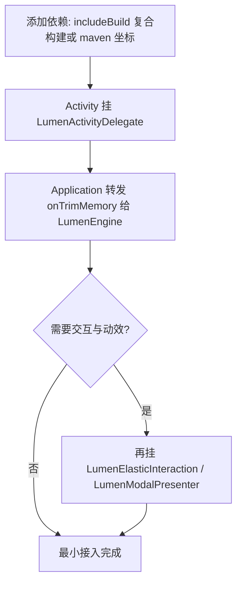

<div align="center">

# 凝光视效引擎

**Lumen Coacervation Engine**

面向 Android View 系统的可移植玻璃材质与视效引擎

<br>

**简体中文**

<br>

[](LICENSE)
[](#要求)
[](https://kotlinlang.org)
[](https://github.com/jichuo1/LumenCoacervationEngine/releases)
[](https://jitpack.io/#jichuo1/LumenCoacervationEngine)
[](https://github.com/jichuo1/LumenCoacervationEngine/issues)

[功能](#功能) · [材质](#两套材质) · [要求](#要求) · [接入](#接入) · [构建](#构建) · [文档](#文档) · [出处与许可](#出处与许可)

</div>

> [!NOTE]
> 本项目抽离自 [Bilibili Innocent Lab](https://github.com/jichuo1/Bilibili_Innocent_Lab)，由原作者以 Apache-2.0 重新授权发布。详见 [出处与许可](#出处与许可)。

---

## 功能

宿主只需声明"这块表面是什么"，由引擎决定怎样画。

<table>
<tr>
<td width="50%" valign="top">

#### 引擎本体（`lumen-engine`）

- 统一的表面材质
- 悬浮栏可读性
- 回弹
- 触摸光晕
- 材质健康回退
- 视效调参：边缘高光厚度与亮度、长按形变程度、长按光晕强度与半径

</td>
<td width="50%" valign="top">

#### 交互与动效（`lumen-motion`，可选）

- 长按拖动形变与触点高光
- 可打断的翻页与文字链
- 弹窗 / 全屏页打开与关闭形变：锚定气泡、标题迁移、面板嵌套、预测式返回
- 手风琴、定位高亮、微动效
- 按卡片尺寸与排布（列表、网格、混排、瀑布流、轮播、卡中卡）自动适配

</td>
</tr>
</table>

---

## 两套材质

| 材质 | 标识 | 实现 | 设备要求 |
|:---|:---|:---|:---|
| 柔光 | `MATERIAL_YOU` | 静态环境磨砂 + 悬浮表面软件透镜 | 全部设备，不会失败 |
| 高级材质 | `LIQUID` | RuntimeShader 折射 + 可选 PixelCopy 实时取样 | REFRACTION 需 API 33+；BLUR 需 API 31+；其余回退 TRANSLUCENT |

> [!NOTE]
> 切到高级材质后，新会话首帧绘制成功才算确认健康。进程在确认前死亡或渲染器失败时，下次启动自动回到柔光，不会反复崩溃。

---

## 要求

| 项 | 说明 |
|:---|:---|
| **系统** | Android 8.1 及以上（`minSdk 27`） |
| **版本** | 1.0.0（契约版本 1，规则见 [`docs/VERSIONING.md`](docs/VERSIONING.md)） |
| **依赖** | 引擎本体只依赖 AndroidX core |
| **可选** | `lumen-motion` 不依赖 AppCompat；`lumen-controls` 依赖 AppCompat + RecyclerView |

| 模块 | 说明 |
|:---|:---|
| `lumen-engine` | 引擎本体（必需） |
| `lumen-motion` | 可选：交互与动效（依赖 `lumen-engine`） |
| `lumen-controls` | 可选：`SwitchCompat` / `CheckBox` / `EditText` 换装、翻页器开关识别、拖拽排序 |
| `sample` | 最小接入示例，每一步都标注了适配标准的节号 |

---

## 接入



**1. 依赖**：三种方式任选其一，详见适配标准 §1.1。

方式 A —— JitPack（版本号即 git tag）：

```kotlin
// settings.gradle.kts
dependencyResolutionManagement {
    repositoriesMode.set(RepositoriesMode.FAIL_ON_PROJECT_REPOS)
    repositories {
        mavenCentral()
        maven { url = uri("https://jitpack.io") }
    }
}

// app/build.gradle.kts
dependencies {
    implementation("com.github.jichuo1.LumenCoacervationEngine:lumen-engine:1.0.0")
    // 可选模块，版本号保持一致
    implementation("com.github.jichuo1.LumenCoacervationEngine:lumen-motion:1.0.0")
    implementation("com.github.jichuo1.LumenCoacervationEngine:lumen-controls:1.0.0")
}
```

方式 B —— 复合构建（本地联调）：

```kotlin
// settings.gradle.kts
includeBuild("../LumenCoacervationEngine")

// app/build.gradle.kts
dependencies {
    implementation("com.lumen.coacervation.engine:lumen-engine:1.0.0")
}
```

方式 C —— 本地 maven 仓：`./gradlew publishAllPublicationsToProjectLocalRepository`，产物在 `build/repo`，加进 `repositories` 后按 `com.lumen.coacervation.engine` 坐标引用。

**2. Activity**：组合式委托，任何 Activity 基类都能用。

```kotlin
class MainActivity : AppCompatActivity() {
    private val lumen = LumenActivityDelegate(this) { LumenPalette.modern(primary, onPrimary, secondary, tertiary, dark) }

    override fun onCreate(savedInstanceState: Bundle?) {
        super.onCreate(savedInstanceState)
        lumen.prepare()                                  // 放在宿主自己的授权门、早退检查之后
        val root = buildContent()                        // 用 lumen.cardBackground() / floatingBackground() 等取表面
        setContentView(root)
        lumen.bindRoot(root) { recreate() }              // 高级材质整体失败时回调一次
    }

    override fun dispatchTouchEvent(event: MotionEvent): Boolean {
        lumen.onDispatchTouchEvent(event)
        return super.dispatchTouchEvent(event)
    }
    override fun onStart() { super.onStart(); lumen.onStart() }
    override fun onStop() { lumen.onStop(); super.onStop() }
    override fun onTrimMemory(level: Int) { lumen.onTrimMemory(level); super.onTrimMemory(level) }
    @Deprecated("Deprecated in Java")
    override fun onLowMemory() { lumen.onLowMemory(); @Suppress("DEPRECATION") super.onLowMemory() }
    override fun onDestroy() { try { lumen.onDestroy() } finally { super.onDestroy() } }
}
```

**3. Application**：处理进程级内存压力。

```kotlin
override fun onTrimMemory(level: Int) {
    super.onTrimMemory(level)
    if (level == TRIM_MEMORY_RUNNING_CRITICAL || level >= TRIM_MEMORY_COMPLETE) LumenEngine.releaseGraphics()
}
```

**4. 材质开关**

```kotlin
if (LumenEngine.selectMaterial(context, SkinId.LIQUID, realtimeCapture = true)) {
    recreate()
} else {
    switch.isChecked = false
}
```

**5. 交互与动效**（可选，`lumen-motion`）

```kotlin
private val elastic by lazy { LumenElasticInteraction(this, lumen) }
private val modals by lazy { LumenModalPresenter(this, lumen, elastic = elastic) }

override fun dispatchTouchEvent(event: MotionEvent): Boolean {
    lumen.onDispatchTouchEvent(event)
    return elastic.dispatch(event) { super.dispatchTouchEvent(it) }   // 长按弹性（§12）
}

// 条目 → 卡片形变；弹窗第一个子 View 是标题，与条目标题同文字时做标题迁移（§13.1、§13.3）
row.setOnClickListener {
    val dialog = Dialog(this)
    val container = modals.createContainer().apply { addView(title); addView(body) }
    modals.present(dialog, container, anchor = row)
}
```

悬浮栏、回弹、控件、翻页、全屏页形变、二级面板等的完整写法，见 `sample/` 和适配标准。

---

## 构建

需要 **JDK 17+** 与 **Android SDK Platform 37**。

```bash
git clone https://github.com/jichuo1/LumenCoacervationEngine.git
cd LumenCoacervationEngine
./gradlew assembleDebug testDebugUnitTest lintDebug --console=plain --no-daemon
```

| 产物 | 命令 / 入口 |
|:---|:---|
| Debug 构建 + 单测 + Lint | `./gradlew assembleDebug testDebugUnitTest lintDebug` |
| 本地 maven 产物 | `./gradlew publishAllPublicationsToProjectLocalRepository` → `build/repo` |

本机 SDK 路径写在 `local.properties` 里，该文件不入库。

---

## 文档

| 文档 | 内容 |
|:---|:---|
| [`docs/INTEGRATION_STANDARD.md`](docs/INTEGRATION_STANDARD.md) | **适配标准**：宿主必须/应当做什么，附验收清单 |
| [`docs/API.md`](docs/API.md) | 公开 API 清单（兼容承诺的范围） |
| [`docs/ARCHITECTURE.md`](docs/ARCHITECTURE.md) | 架构：分层、会话、状态机、两条渲染管线 |
| [`docs/ENGINEERING_RULES.md`](docs/ENGINEERING_RULES.md) | 修改引擎本体必须遵守的规则（旧系统安全、零反射、零分配、失败隔离） |
| [`docs/VERSIONING.md`](docs/VERSIONING.md) | 版本号与契约版本规则 |
| [`docs/BETTERANDROID_INITIATIVE.md`](docs/BETTERANDROID_INITIATIVE.md) | 关于 BetterAndroid 写法的倡议 |
| [`docs/PORTABILITY_AUDIT.md`](docs/PORTABILITY_AUDIT.md) | 从来源工程抽离时的可移植性审查报告 |
| [`CHANGELOG.md`](CHANGELOG.md) | 更新记录 |

---

## 反馈

使用交流与问题讨论请提交 [Issue](https://github.com/jichuo1/LumenCoacervationEngine/issues)，并附上：

1. Android 版本与设备型号
2. 接入方式（复合构建 / maven）与引擎版本
3. 复现步骤；涉及渲染问题时注明所用材质与 `SkinId`
4. 崩溃或异常日志（请去掉账号、路径等无关隐私）

---

## 出处与许可

引擎抽离自 [Bilibili Innocent Lab](https://github.com/jichuo1/Bilibili_Innocent_Lab)，由原作者以 [Apache License 2.0](LICENSE) 重新授权发布，详见 [`NOTICE`](NOTICE)。来源工程本身仍沿用它原来的许可证。

抽离时的主要工程变更包括：

- 包名与坐标统一为 `com.lumen.coacervation.engine`
- 去除来源工程业务依赖（BetterAndroid、宿主基类、资源色解析），引擎本体只依赖 AndroidX core
- 悬浮栏、控件换装、交互动效拆分为可选模块
- 配套适配标准、公开 API 清单与可移植性审查报告

## 致谢

| 项目 | 说明 |
|:---|:---|
| [Bilibili Innocent Lab](https://github.com/jichuo1/Bilibili_Innocent_Lab) | 来源工程 |
| [AndroidX](https://developer.android.com/jetpack/androidx) | 引擎基础组件 |
| [Kotlin](https://kotlinlang.org) | 实现语言 |

<div align="center">

<br>

**[Apache-2.0](LICENSE)** · [Issues](https://github.com/jichuo1/LumenCoacervationEngine/issues) · [Releases](https://github.com/jichuo1/LumenCoacervationEngine/releases)

<sub>感谢来源工程，以及每一位提交 Issue 与参与测试的用户。</sub>

</div>
